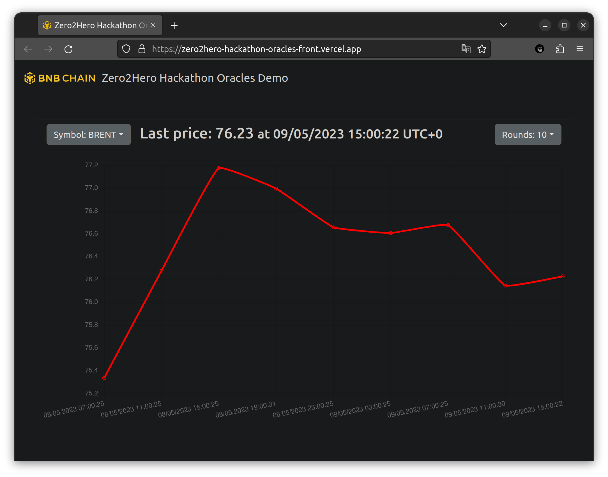

# Decentralized Financial Data Supply Oracle System

*Inspired by Chainlink. Made from scratch.*

## Demo frontend

https://zero2hero-hackathon-oracles-front.vercel.app/



## Overview

The scheme could be represented as ASCII-graphics:

```
                       Client
                         |
                    PriceOracle
                         |
     +-------------------+----------------------------+
     |                   |                            |
   Symbol              Symbol                       Symbol
     |                   |                            |
     |                   |                            |
Aggregator          Aggregator <== Heartbit      Aggregator 
     |                   |                            |
    ...          +-------+-------+                   ...
                /        |        \
         Transmitter Transmitter Transmitter
```

### Description of components

* Client uses, for example, getLastPrice of PriceOracle to get access to the latest price of some symbol
* PriceOracle is a proxy for calling Symbols that stores the corresponding symbol code - Symbol address
* Symbol - a contract that stores the price history of a specific symbol and allows you to access the latest price (main function)
* Aggregator - a contract that processes and checks incoming prices from Transmitters
* Heartbit is an external tool (script) that periodically calls the Aggregator to open and close the so-called rounds
* Transmitter - script that listens for the round opening event in the Aggregator, extracts the price from the price provider and sends it to the Aggregator

### Additional information

* to check transmitters, an ECDSA signature is used, which they attach in a transaction with a price
* the price deviation from the previous known one is checked, the delay of the response at the level of the timestamp from the transmitter and the timestamp of the response transaction
* if the average price of the round (from all transmitters that sent the price to the Aggregator) does not differ from the average price of the previous round, then it is not saved in the Symbol
* all smart contracts are Ownable and allow hot swapping
* check out [CONFIG.md](CONFIG.md) for deployed contracts addresses

# Installation and usage

1. `contracts` folder contains the Hardhat project, there is a script to deploy all smart-contracts and even two tasks `transmitterAdd` and `transmitterDelete` to manipulate allowed transmitters list in the Aggregator contracts (look at the end of [CONFIG.md](CONFIG.md) for examples)
2. `front` folder is a simple one-page project using HTML and JS to show chart of prices, consider host it everywhere
3. `heartbit` folder contains NodeJS project, simply copy it, `cd` into the folder and start using command `node index.js` or using PM2 `pm2 start -n heartbit index.js`
4. `transmitter` folder contains NodeJS project aimed to extract prices from price provider and send them every time when `heartbit` starts new round, simply copy it, `cd` into the folder and start using command `node index.js` or using PM2 `pm2 start -n transmitter_symbol index.js`, do not forgot update `.env` with correct values (check out `.env.example`)

# Technologies

* Solidity (+ OpenZeppelin)
* Hardhat (+ `@nomiclabs/hardhat-etherscan`, `hardhat-gas-reporter`, `solidity-coverage`)
* Slither to audit smart-contracts
* PM2, NodeJS, HTML, JS

# Thanks

Many thanks for a great opportunity to learn and improve skills to:

* Center of Blockchain (Astana)
* Encode Club
* BNB Chain Community